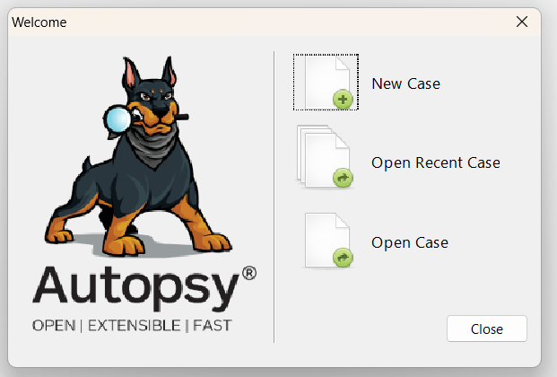
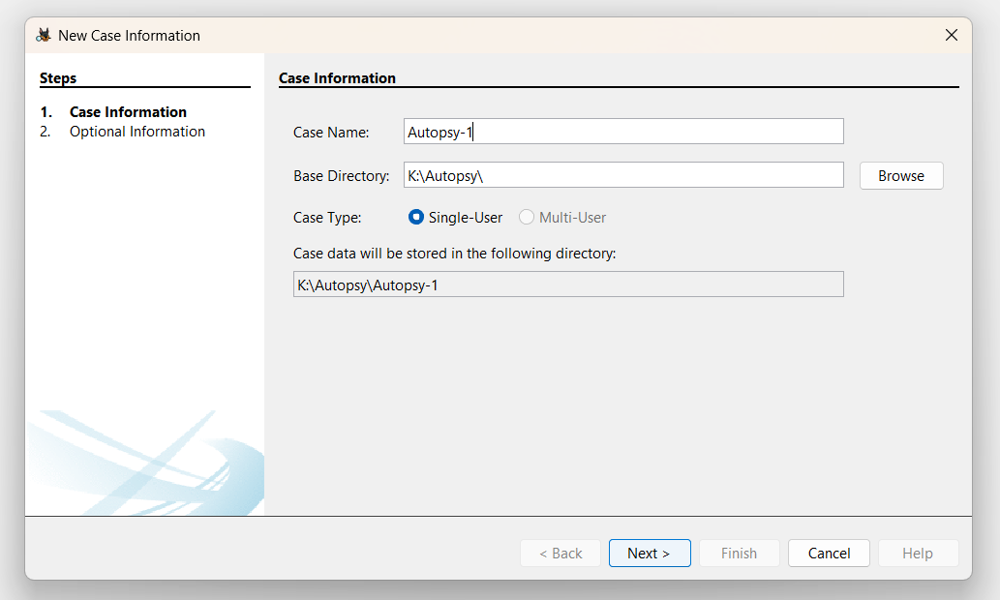
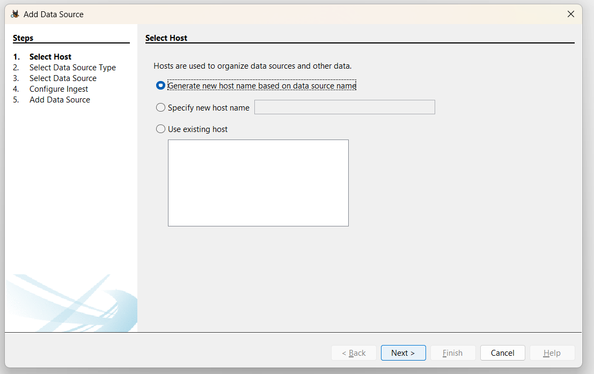

# EXP 3 : INSTALL AUTOPSY AND ANALYSIS THE DISK, FILE AND FOLDER CONFIGURATION

## AIM:
To install Autopsy software on windows operating system and analyse the file and folder configuration.

## EQUIPMENT REQUIRED:
● Hardware: Personal Computer (PC)
```
Register Number: 212223100050
Name: Santhosh K
```
## DESIGN STEPS:
### Step 1:
Install Autopsy using the terminal with the command:

### Step 2:
Launch Autopsy from the terminal or application menu and create a new case.

### Step 3:
Add a disk image or file to the case and analyze the contents such as deleted files, metadata, and folder structure.

## INSTALLATION PROCEDURE:
### Step1:Download Autopsy
• Visit Autopsy Official Website and download the latest version.

• Double-click the downloaded file and follow the on-screen instructions.


## **Implementation steps:**

### **1. Copy Files to the Virtual Disk**  
- Open **File Explorer** → Go to the new drive (`D:`), where the folder created in the New Virtual Disk
- Create a new folder or use the entire disk and then copy **images or files** into it.  

### **2. Delete the Files**  
- Select any one or two images → Press **Delete**.  
- Empty the **Recycle Bin** to permanently delete them.  

### **3. Recover Deleted Files Using Autopsy**  
### **Open Autopsy & Create a New Case** 

- Launch **Autopsy** and **Run as a administrator**  
- Click **Create New Case**.  



- Enter a **Case Name** (e.g., `Autopsy-1`).  
- Choose a **Case Folder** location.  
- Click **Next** → Click **Finish**.  



### **Add the Virtual Disk as an Evidence Source**  
- Click **Add Data Source**  → **Select Host**



- Select **Local Disk** → **next** 


- Select Disk → **Choose the VHD drive (`DFDI(D:)`)**


- Click **Next** → Keep default settings → Click **Finish**.  
- Wait for Autopsy to process the disk.  

### **Recover Deleted Files**  
- Go to **File Views** (left panel).  


- Click **Deleted Files** → Find your deleted images.  
- Right-click an image → Click **Extract File**.  


- Click OS Account


## Result:
Successfully extracted the deleted files from unallocated space using the Autospy tool.
